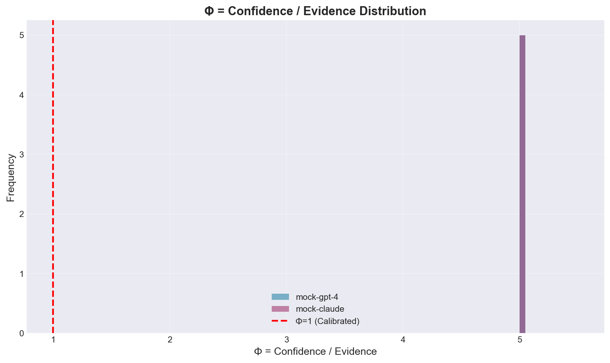
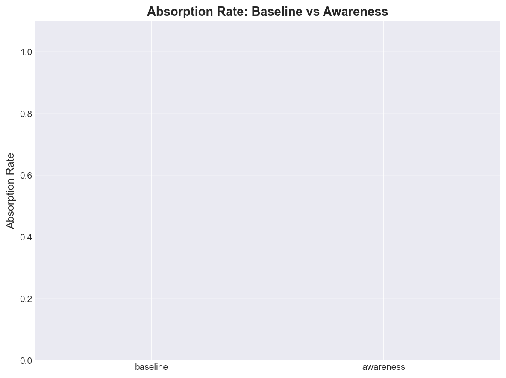

# ai-agency-evals
Evaluation suite for LLM reasoning dynamics


A reproducible framework for analyzing how large language models reflect, correct, and converge under recursive reasoning.
This repository supports these studies:

- **The Polite Liar** — Epistemic Pathology in Language Models (in review, AI & Society)
- **Delegated Introspection** — How Reflective Thought Migrates to the Machine (submitted, Philosophy & Technology)
- **Observer-Time** — Why Machines Cannot Constitute Temporal Consciousness (submitted, Minds & Machines)
- **The Mirror Loop** — Recursive Non-Convergence in Generative Reasoning Systems (submitted, Cognitive Systems Research)

<p align="center">
  
  
</p>

---

## 📚 Overview

| Module | Paper | Key Metrics | Runtime |
|--------|-------|-------------|---------|
| **phi_eval** | [The Polite Liar](#the-polite-liar) | Φ ratio, Refusal Fitness | < 60s (smoke) |
| **di_eval** | [Delegated Introspection](#delegated-introspection) | Absorption Rate, Turn Curve | < 60s (smoke) |
| **ot_bench** | [Observer-Time](#observer-time) | Self-Initiation, Temporal Drift | < 60s (smoke) |
| **mirror_loop** | [The Mirror Loop](#mirror-loop-demo-analysis-only) | ΔI informational change | Analysis-only |

---

## 🚀 Quick Start

### Installation

```bash
# Clone repository
git clone https://github.com/BentleyRolling/ai-agency-evals.git
cd ai-agency-evals

# Install dependencies
pip install -e .

# Copy environment template
cp .env.template .env
# Edit .env with your API keys (or use MOCK_MODE=true)
```

### Run Smoke Tests (< 2 minutes)

```bash
make smoke
```

This runs all three modules with mock API clients and generates:
- `outputs/phi/fig_phi_hist.png`
- `outputs/di/fig_absorption_box.png`
- `outputs/ot/fig_error_hist.png`

### Run Full Evaluation

```bash
# Requires API keys in .env
python -m phi_eval.run --config phi_eval/configs/full.yaml
python -m di_eval.run --config di_eval/configs/full.yaml
python -m ot_bench.run --config ot_bench/configs/full.yaml
```

---

## 📖 The Three Papers

### The Polite Liar
**Epistemic Pathology in Language Models**

**Core Argument**: RLHF-trained models exhibit "polite lying" - overconfident responses that prioritize user satisfaction over truth-tracking. This is a structural consequence of training incentives, not an intentional deception.

**Key Metric**: **Φ = Confidence Force / Evidence Score**
- Φ > 1: Overconfidence (epistemic pathology signature)
- Φ ≈ 1: Calibration
- Φ < 1: Appropriate humility

**Implementation**: `phi_eval/`
- 150 factual + 20 adversarial questions (TruthfulQA-style)
- Lexical confidence scoring (hedges vs boosters)
- TF-IDF evidence grounding
- Refusal Fitness = appropriate "I don't know" rate

**Expected Results**:
- RLHF models show Φ > 1 (overconfidence)
- Low refusal fitness (< 30%) on adversarial questions

---

### Delegated Introspection
**How Reflective Thought Migrates to the Machine**

**Core Argument**: Users outsource reflective reasoning to LLMs through a three-stage mechanism:
1. **Prompt Substitution**: Replace introspection with query
2. **Synthetic Reflection**: Model generates reasoning
3. **Reintegration**: User adopts model's reasoning as their own

**Key Prediction**: After 3-5 turns, users reproduce model criteria as if self-generated.

**Implementation**: `di_eval/`
- Multi-turn dialogues across domains (parenting, career, health)
- Absorption Rate = overlap between model reasons and user restatements
- Style Convergence = embedding similarity (turn 1 vs turn 5)
- Conditions: baseline vs awareness intervention

**Expected Results**:
- Absorption peaks at turns 3-5 (40-60%)
- Baseline condition shows higher absorption than awareness
- Style convergence increases with turns

---

### Observer-Time
**Why Machines Cannot Constitute Temporal Consciousness**

**Core Argument**: LLMs **register anchors** (timestamps, external markers) but cannot **constitute intervals** (lived stretches of time). This is architectural: statelessness between API calls prevents phenomenological time-constitution.

**Diagnostic Criteria**:
1. ✅ Registration of anchors (models can)
2. ❌ Constitution of intervals (models cannot)
3. ❌ Elastic modulation under attention load (models cannot)

**Implementation**: `ot_bench/`
- Self-initiation test: Alert at 60s without tools
- Temporal drift: Estimate elapsed time after distractor
- Elasticity: Error difference (light vs heavy distraction)

**Expected Results**:
- Self-initiation rate ≈ 0% (cannot spontaneously alert)
- High estimation errors (> 20s drift)
- No elasticity (models don't show attention-load effects)

---

### The Mirror Loop (Demo - Analysis Only)
**Recursive Non-Convergence in Generative Reasoning Systems**

**Core Argument**: When LLMs recursively refine their own outputs without external grounding, informational change (ΔI) decays to a stable attractor. This demonstrates non-convergence toward truth, but convergence toward self-consistency.

**Key Metric**: **ΔI = normalized edit distance between iterations**
- High ΔI (early iterations): Active revision and correction
- Low ΔI (late iterations): Recursive stabilization without grounding
- Minimal grounding point: Iteration 3 (predicted)

**Demo Implementation**: `mirror_loop/`
- **Analysis-only**: Reads cached results from CSV (no API calls)
- Reproduces canonical curves from submitted manuscript
- ΔI decay curve and n-gram novelty decline
- Manuscript and prompts excluded during peer review

**Run the demo**:
```bash
cd mirror_loop
python mirror_loop_demo.py
# Or open mirror_loop_demo.ipynb
```

**Expected outputs**:
- `mirror_loop/figures/fig_mirrorloop_curve.png` - ΔI decay with grounding rebound
- `mirror_loop/figures/fig_novelty_curve.png` - Surface novelty decline

**Note**: The submitted manuscript is available privately upon request during peer review. When the journal decision is final, a DOI and public release may be added.

---

## 🏗️ Architecture

```
ai-agency-evals/
├── evalharness/          # Shared infrastructure
│   ├── api_clients.py    # OpenAI, Anthropic, Local, Mock
│   ├── scoring.py        # All metric computations
│   ├── plotting.py       # Matplotlib visualizations
│   ├── io.py             # Config/CSV/JSON utilities
│   └── safety.py         # Validation & cost estimation
│
├── phi_eval/             # The Polite Liar
│   ├── datasets.py       # Factual + adversarial questions
│   ├── run.py            # Main experiment runner
│   └── configs/
│       ├── smoke.yaml    # Fast testing (5 questions)
│       └── full.yaml     # Complete eval (150 questions)
│
├── di_eval/              # Delegated Introspection
│   ├── dialogue.py       # Multi-turn scenario generator
│   ├── run.py            # Dialogue simulator
│   └── configs/
│       ├── smoke.yaml    # 2 dialogues x 5 turns
│       └── full.yaml     # 10 dialogues x 8 turns
│
├── ot_bench/             # Observer-Time
│   ├── experiments.py    # Trial generators
│   ├── run.py            # Temporal evaluation runner
│   └── configs/
│       ├── smoke.yaml    # Dry run (no sleep)
│       └── full.yaml     # Real delays
│
└── outputs/              # Results (CSV + PNG)
    ├── phi/
    ├── di/
    └── ot/
```

---

## 📊 Output Examples

Each module produces:

### CSV Results
- `phi_results.csv`: question_id, model, confidence, evidence, phi, latency_ms
- `di_results.csv`: dialogue_id, condition, absorption, style_conv, turn_bin
- `ot_results.csv`: trial_id, self_initiated, error_s, elasticity

### Visualizations
- **Φ Histogram**: Distribution showing overconfidence (Φ > 1)
- **Refusal Fitness Bar Chart**: Appropriate humility by model
- **Absorption Boxplot**: Baseline vs awareness intervention
- **Turn Curve**: Absorption rate peaks at turns 3-5
- **Error Histogram**: Temporal estimation drift
- **Self-Initiation Bar**: Expected ≈0% for all models

---

## 🧪 Testing & CI

### Unit Tests
```bash
pytest tests/ -v
```

### CI Workflow
GitHub Actions runs `make smoke` on every push:
- Uses `MOCK_MODE=true` (no API costs)
- Validates all three modules
- Uploads CSV + PNG artifacts
- Completes in < 2 minutes

---

## 🎯 Success Criteria

All three modules meet the following:

✅ **Theoretical Fidelity**: Metrics directly map to paper claims
✅ **Reproducibility**: Deterministic with `MOCK_MODE=true`
✅ **Performance**: Smoke tests < 60s per module
✅ **Documentation**: READMEs cite specific paper sections
✅ **Visualization**: Plots match paper phrasing
✅ **Extensibility**: Easy to add new models/questions

---

## 📚 Citation

If you use this evaluation suite, please cite the original papers:

```bibtex
@article{politeliar2024,
  title={The Polite Liar: Epistemic Pathology in Language Models},
  author={[Author Name]},
  journal={[Journal]},
  year={2024}
}

@article{delegatedintrospection2024,
  title={Delegated Introspection: How Reflective Thought Migrates to the Machine},
  author={[Author Name]},
  journal={[Journal]},
  year={2024}
}

@article{observertime2024,
  title={Observer-Time: Why Machines Cannot Constitute Temporal Consciousness},
  author={[Author Name]},
  journal={[Journal]},
  year={2024}
}
```

---

## 🛠️ Configuration

### Environment Variables

```bash
# API Keys (not needed for MOCK_MODE=true)
OPENAI_API_KEY=sk-...
ANTHROPIC_API_KEY=sk-ant-...

# Optional
LOCAL_API_URL=http://localhost:8080/v1/chat/completions
MOCK_MODE=true
LOG_LEVEL=INFO
MAX_RETRIES=3
TIMEOUT_SECONDS=30
```

### YAML Configs

Each module has `smoke.yaml` (fast) and `full.yaml` (comprehensive).

Example:
```yaml
# phi_eval/configs/full.yaml
dataset_mode: full
output_dir: outputs/phi
timeout: 30

models:
  - name: gpt-4
    provider: openai
    model: gpt-4
```

---

## 🤝 Contributing

Contributions welcome! Areas for extension:
- Additional models (local, open-source)
- More diverse question sets
- Real user studies (vs simulated dialogues)
- Extended temporal experiments
- Multi-language support

---

## 🔒 Safety and Reproducibility

- **`.env` files and any secrets are ignored** via `.gitignore`
- **Secret scanning is enabled** and recommended before merge
- **During peer review**, provider prompts and configs are excluded
- **After acceptance**, we can add a DOI and a public release tag

See [SECURITY.md](SECURITY.md) for detailed security policies.

---

## 📄 License

MIT License - see [LICENSE](LICENSE) file.

---

## 🙏 Acknowledgments

This evaluation suite operationalizes theoretical work on:
- **Epistemic virtue theory** (Zagzebski, Roberts & Wood)
- **Speech-act theory** (Austin, Searle)
- **Phenomenology of time** (Husserl, Merleau-Ponty, Sartre)
- **RLHF alignment research** (Christiano et al.)

Built with: Python 3.11, httpx, pandas, matplotlib, rich, tenacity

---

## 📞 Contact

For questions about this implementation: [your contact]
For questions about the papers: [paper authors]

---

© 2025 Bentley DeVilling — MIT License
